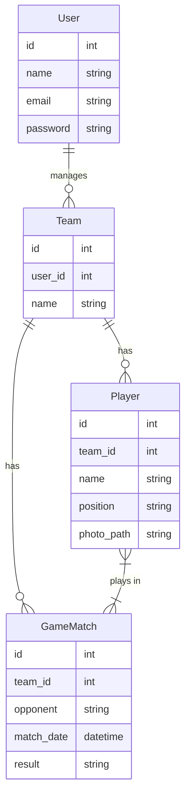

# Squad Management Dashboard

A comprehensive dashboard for football coaches to manage their squads, track player performance, and organize match lineups. Built with Laravel.

## 📋 Features

- **Coach Dashboard**: Manage multiple teams (e.g., U-18, First Team).
- **Roster Management**: Add and manage players within teams.
- **Match Scheduling**: Create and track match schedules.
- **Lineup Builder**: Assign players to matches and form lineups.
- **Performance Tracking**: Track specific stats per match (Goals, Minutes Played).
- **Media Support**: Upload player photos or team logos.

## 🛠️ Tech Stack

- **Framework**: Laravel 12.x
- **Database**: SQLite (Default) / MySQL
- **Frontend**: Blade Templates + Tailwind CSS (via CDN)
- **Testing**: Pest PHP

## 🚀 Installation & Setup

Follow these steps to get the project running locally.

### Prerequisites
- PHP 8.2 or higher
- Composer
- Node.js & NPM (Optional, for asset customization)

### Step-by-Step Guide

1. **Clone the Repository**
   ```bash
   git clone <your-repo-url>
   cd squad-management
   ```

2. **Install Dependencies**
   ```bash
   composer install
   ```

3. **Environment Configuration**
   Copy the example environment file and configure it:
   ```bash
   cp .env.example .env
   ```
   *Modify `.env` to set your database connection if not using SQLite.*

4. **Generate Application Key**
   ```bash
   php artisan key:generate
   ```

5. **Run Migrations & Seeders**
   Set up the database structure and populate it with sample data:
   ```bash
   touch database/database.sqlite # If using SQLite
   php artisan migrate --seed
   ```

6. **Serve the Application**
   ```bash
   php artisan serve
   ```
   Visit `http://localhost:8000` in your browser.

## 📊 Database Schema (ERD)

The application follows a strictly defined relational schema.



### Pivot Table: `match_player`
The Many-to-Many relationship between `Player` and `GameMatch` stores performance metrics:
- `goals` (int)
- `minutes_played` (int)

## 📷 Screenshots

| Dashboard | Team Roster |
|:---:|:---:|
| *(Place screenshot here)* | *(Place screenshot here)* |

| Match Lineup | Player Stats |
|:---:|:---:|
| *(Place screenshot here)* | *(Place screenshot here)* |

## ✅ Code Quality & Grading Criteria

This project adheres to strict backend development standards:
- **No N+1 Queries**: Uses Eager Loading (`with()`) for interactions.
- **Security**: Implements Policies/Gates to ensure coaches only manage their own teams.
- **Validation**: All inputs are validated using FormRequests.
- **RESTful**: Routes and Controllers follow standard CRUD conventions.

## 👥 Authors
- [Your Name]

